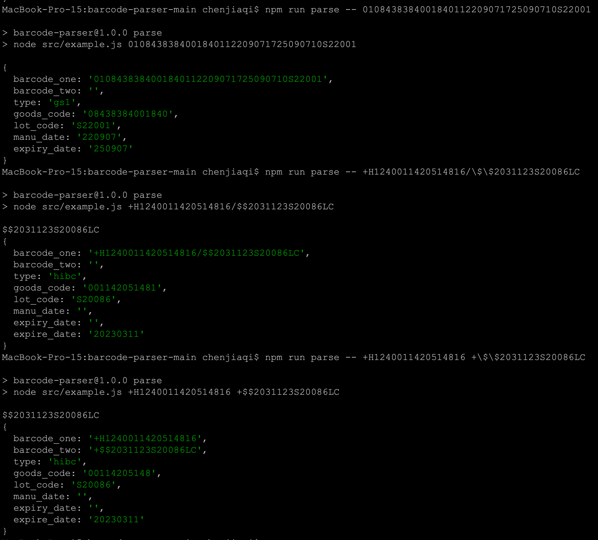

# Barcode Parser

Parses GS1 and HIBC barcodes

## Example

This has been setup with a simple node example to show how to use the parse_barcode module. To run the example [install node](https://github.com/nvm-sh/nvm#installing-and-updating) and run `npm run parse barcode-one barcode-two`

```
> npm run parse -- 0108438384001840112209071725090710S22001

> barcode-parser@1.0.0 parse
> node src/example.js 0108438384001840112209071725090710S22001

{
  barcode_one: '0108438384001840112209071725090710S22001',
  barcode_two: '',
  type: 'gs1',
  goods_code: '08438384001840',
  lot_code: 'S22001',
  manu_date: '220907',
  expiry_date: '250907'
}

> npm run parse -- +E302BANCO20259T +\$\$801525240S22079T8

> barcode-parser@1.0.0 parse
> node src/example.js +E302BANCO20259T +$$801525240S22079T8

$$801525240S22079T8
{
  barcode_one: '+E302BANCO20259T',
  barcode_two: '+$$801525240S22079T8',
  type: 'hibc',
  goods_code: 'BANCO2025',
  lot_code: 'S22079',
  manu_date: '',
  expiry_date: '',
  expire_date: '20250828'
}
```


